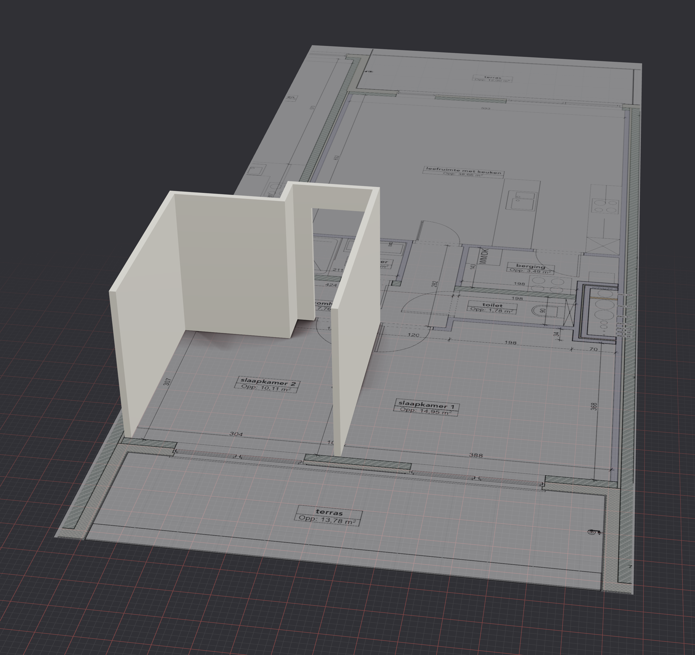

# Floor plan VR

> Note: This repo is still a proof of concept.

Turn a floorplan into a walkable vr environment.

Room setup and tweaks are js objects (could be json driven).
Creating the rooms is currently a manual task

## Features:

-   render a floor plan using a png
-   set the scale of the floor plan
-   render wall sections
-   add a doors to a wall section

